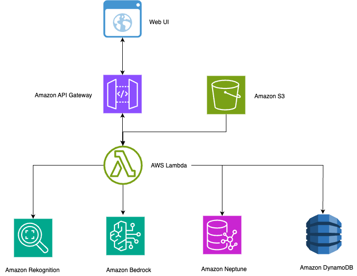
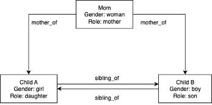
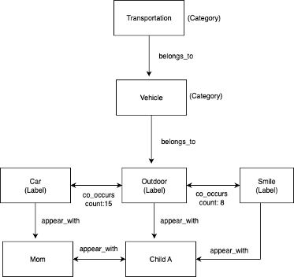

# Image Recognition with Neptune Graph Database

A serverless image recognition and captioning system built with AWS CDK. This system can index faces, recognize people in photos, and generate AI-powered captions with relationship context using Amazon Neptune.

## Architecture


## Neptune Graph Database Structure

The system uses Neptune to store relationships and hierarchies as a graph:

### Sample Family Relationship Graph (Demo)


### Example Label Hierarchy and Co-occurrence Network


### How Neptune Powers Relationship Search

1. **Query**: "person's mother"
2. **Neptune Traversal**: `g.V().has('name', 'person').inE().has('type', 'mother_of').outV().values('name')`
3. **Result**: Returns the mother's name
4. **Image Search**: Finds images containing both the person and their mother

### Supported Relationship Queries
- **Parent-Child**: "person's kids", "person's mom", "person's mother"
- **Siblings**: "person's brother", "person's sister", "person sibling"
- **Multi-step**: "person's brother's mom", "person's children's friends"
- **Dynamic Groups**: "person's family", "siblings together"
- **Role-based**: "mothers with cars", "children outdoor"
- **Labels**: "outdoor", "birthday", "person car", "family food"
- **Label hierarchies**: "vehicle" finds all car/truck photos
- **Co-occurrence**: "celebration" finds birthday/party contexts

## Components

### Backend (AWS CDK)

- **S3 Bucket**: Stores images and triggers Lambda functions
  - `faces/` prefix: For reference face images
  - `images/` prefix: For images to be processed

- **Lambda Functions**:
  - `face_indexer.py`: Indexes reference faces with names
  - `image_processor.py`: Processes images for recognition, labeling, and captioning (conservative captions)
  - `search_handler.py`: Handles search queries with Neptune relationship support (filters no-face images)
  - `faces_handler.py`: Lists indexed faces
  - `style_caption.py`: Generates styled captions
  - `relationships_handler_neptune.py`: Manages relationships in Neptune
  - `label_relationships.py`: Queries label relationships (top 5 meaningful labels)

- **DynamoDB Table**: Stores image metadata, recognized faces, labels, and captions

- **Neptune Graph Database**: Stores relationships with person attributes
  - Enables dynamic relationship queries
  - Scales to hundreds of people with complex relationship trees
  - Powers natural language relationship search

- **Rekognition**: Face detection and recognition, object and scene labeling

- **Bedrock**: AI-powered image captioning using Claude 3.5 Sonnet

- **API Gateway**: REST API endpoints

### Frontend (HTML/CSS/JavaScript)

- **demo.html**: Web UI with search, face display, and style selection

## File Structure

```
image-name-cap-cdk/
├── app.py                           # CDK application entry point
├── image_name_cap_stack_neptune.py  # Neptune CDK stack definition
├── lambda/                          # Lambda function code
│   ├── face_indexer.py              # Face indexing function
│   ├── faces_handler.py             # List indexed faces
│   ├── image_processor.py           # Process images and generate captions
│   ├── search_handler.py            # Search images with Neptune support
│   ├── style_caption.py             # Generate styled captions
│   ├── relationships_handler_neptune.py # Manage Neptune relationships
│   ├── label_relationships.py       # Query label relationships
│   └── neptune_search.py            # Neptune relationship parsing
├── lambda_layer/                    # Lambda layer for Pillow
├── neptune_layer/                   # Lambda layer for gremlinpython
├── ui/                              # Web UI files
│   └── demo.html                    # Main UI
└── README.md                        # This file
```

## Prerequisites

- AWS CLI configured with appropriate permissions
- AWS CDK installed (`npm install -g aws-cdk`)
- Python 3.11+
- Docker (for Lambda layers)

## Setup and Deployment

1. **Install dependencies**:
   ```bash
   pip install -r requirements_neptune.txt
   ```

2. **Bootstrap CDK** (first time only):
   ```bash
   cdk bootstrap
   ```

3. **Deploy the stack**:
   ```bash
   cdk deploy
   ```

4. **Note the outputs**:
   - `ApiEndpoint`: The API Gateway URL
   - `BucketOut`: The S3 bucket name
   - `NeptuneEndpoint`: The Neptune cluster endpoint
   - `UserPoolId`: Cognito User Pool ID
   - `UserPoolClientId`: Cognito User Pool Client ID

## Usage

### 1. Index Reference Faces
Upload reference photos to `faces/{person_name}/{person_name}1.jpg`:
```bash
aws s3 cp alice1.jpg s3://YOUR_BUCKET/faces/alice/alice1.jpg
aws s3 cp bob1.jpg s3://YOUR_BUCKET/faces/bob/bob1.jpg
```

### 2. Initialize Sample Relationships
**Note**: All API endpoints require authentication. Use the web UI or get a JWT token first.

**Option A: Use the Web UI** (Recommended)
- Sign in to the web UI and use the interface to initialize relationships

**Option B: Use curl with JWT token**
```bash
# First, get JWT token by signing in through the web UI or Cognito API
# Then use the token in API calls:
curl -X POST https://YOUR_API_ENDPOINT/relationships \
  -H "Content-Type: application/json" \
  -H "Authorization: Bearer YOUR_JWT_TOKEN" \
  -d '{"action": "initialize"}'
```

This creates a fictional sample family structure for demonstration:
- **Alice** (mother, woman)
- **Bob** (daughter, girl) 
- **Charlie** (son, boy)
- Relationships: Alice → mother of Bob/Charlie, Bob ↔ Charlie siblings

**Note**: Alice, Bob, and Charlie are fictional names used for demonstration purposes only. This is a mock family relationship structure to showcase Neptune's graph capabilities.

### 3. Process Images
Upload images to the `images/` prefix for automatic processing:
```bash
aws s3 cp family_photo.jpg s3://YOUR_BUCKET/images/family_photo.jpg
```

### 4. Authentication Setup
The system uses Amazon Cognito for user authentication:

1. **Configure the UI**:
   - Open `ui/demo.html` in a browser
   - Enter API Gateway endpoint
   - Enter S3 bucket name
   - Enter User Pool ID (from CDK output)
   - Enter Client ID (from CDK output)
   - Click "Save"

2. **Create User Account**:
   - Enter email and password (8+ chars, mixed case, digits)
   - Click "Sign Up"
   - Check email for verification link
   - Click verification link

3. **Sign In**:
   - Enter verified email and password
   - Click "Sign In"
   - Session persists across browser refreshes

### 5. Use the Web UI
1. After signing in, search for images by person name or caption content
2. View indexed faces and change caption styles
3. All API calls are authenticated with JWT tokens
4. Sign out when finished

### 6. Relationship-based Search Examples
*Note: Examples use fictional demo names*
- **Simple**: "alice's kids", "bob sibling"
- **Multi-step**: "alice's children's friends"
- **Dynamic**: "alice's family", "siblings together"
- **Role-based**: "mothers with cars", "children outdoor"

## API Endpoints

**Authentication Required**: All endpoints require a valid JWT token in the `Authorization: Bearer <token>` header.

- `POST /faces`: Index a face with name
- `POST /images`: Process uploaded image
- `GET /search?q=term`: Search images
- `GET /faces-list`: List indexed faces
- `POST /style-caption`: Generate styled caption
- `GET /relationships`: Get relationships
- `POST /relationships`: Add relationships
- `GET /label-relationships`: Query label relationships
  - `?type=person_labels&name=person` - Top 5 meaningful labels a person appears with
  - `?type=label_people&name=car` - People who appear with a label
  - `?type=common_labels&name=person1&person2=person2` - Common labels
  - `?type=label_hierarchy&name=car` - Category hierarchy for label
  - `?type=label_cooccurrence&name=outdoor` - Labels that co-occur
  - `?type=category_labels&name=vehicle` - All labels in category

**Example API Call**:
```bash
curl -X GET "https://YOUR_API_ENDPOINT/search?q=alice" \
  -H "Authorization: Bearer YOUR_JWT_TOKEN"
```

## Caption Styles

The system supports multiple AI-generated caption styles:
- **Objective**: Factual description
- **Warm**: Friendly, positive description
- **Funny**: Humorous, playful description
- **Poetic**: Artistic description with imagery
- **Dramatic**: Movie-like scene description

## Advanced Neptune Capabilities

### Why Neptune vs DynamoDB for Relationships?

Neptune enables complex queries impossible with traditional databases:

**Multi-step Relationships:**
- "person's brother's friends" - traverses multiple relationship hops
- "person's children's classmates" - dynamic relationship expansion

**Dynamic Family Queries:**
- "person's extended family" - finds all connected family members
- "siblings together" - finds any sibling pairs in photos

**Role-based Searches:**
- "mothers with cars" - combines person attributes with labels
- "grandparents with grandchildren" - multi-generational traversals

These queries require **graph traversal algorithms** that Neptune provides natively.

## Label Detection and Search

The system uses Amazon Rekognition to detect objects, scenes, and activities in photos:

### Detected Labels Include:
- **Objects**: Car, Food, Table, Phone, Book, etc.
- **Scenes**: Outdoor, Indoor, Restaurant, Beach, etc.
- **Activities**: Birthday, Wedding, Sports, etc.
- **Attributes**: Smile, Clothing, etc.

### Label-based Search:
- **Single labels**: "car", "outdoor", "food"
- **Combined searches**: "person car", "family outdoor"
- **Activity searches**: "birthday", "celebration"

### Neptune Label Relationships:
- Creates connections between people and objects they appear with
- Builds label hierarchies (car → vehicle → transportation)
- Tracks label co-occurrence patterns (outdoor + car = road trip context)
- **Returns top 5 meaningful labels** per person (excludes generic terms like "person", "face", "adult")
- Enables queries like "what objects does person appear with?"
- Powers contextual search and semantic discovery

## Security and Privacy

This solution implements comprehensive security measures:

### Authentication
- **Cognito User Pools**: Secure user authentication with JWT tokens
- **Email verification**: Required for account activation
- **Password policy**: 8+ characters, mixed case, digits required
- **Session management**: Automatic token refresh and secure logout

### Data Encryption
- **At Rest**: AES-256 encryption for S3, DynamoDB, and Neptune
- **In Transit**: TLS 1.2 for all API communications
- **Keys**: AWS KMS managed keys with automatic rotation

### Network Security
- Neptune and Lambda functions in private VPC subnets
- API Gateway as the only public endpoint with CORS and rate limiting
- Security groups restricting Neptune access to Lambda functions only
- All API endpoints require valid JWT authentication

### Access Control
- Least-privilege IAM policies for all components
- Resource-specific permissions for Lambda functions
- User-based access control via Cognito
- No external data sharing - all data remains in your AWS account

## Clean Up

To avoid incurring charges, delete resources in this order:

1. **Delete images from S3 bucket**:
   ```bash
   aws s3 rm s3://YOUR_BUCKET_NAME --recursive
   ```

2. **Destroy the CDK stack**:
   ```bash
   cdk destroy
   ```

3. **Remove Rekognition face collection**:
   ```bash
   aws rekognition delete-collection --collection-id faces
   ```

## Notes

- Face recognition works best with clear, front-facing photos
- The system automatically resizes large images for processing
- **Captions use conservative language** to avoid incorrectly attributing actions to specific people
- **Label queries return top 5 meaningful results** with generic labels filtered out
- **Relationship searches only show images with recognized faces** (no face detection failures)
- Neptune enables scalable relationship queries and multi-hop traversals
- System includes automatic retry logic for Bedrock throttling
- Label detection provides object/scene context with 70%+ confidence threshold
